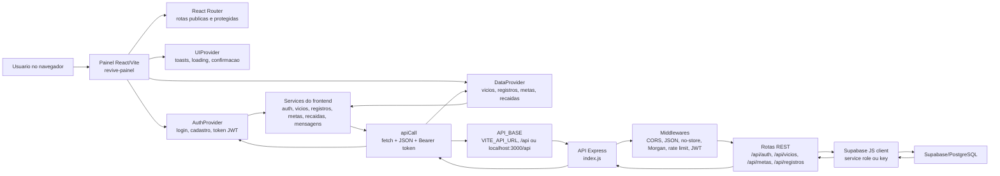
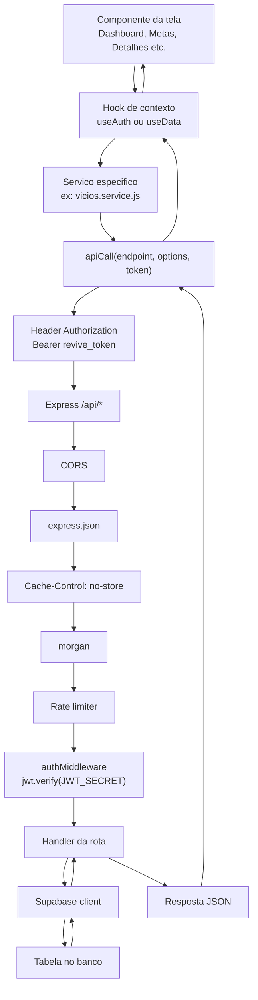
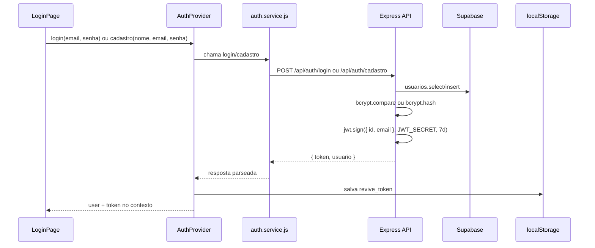
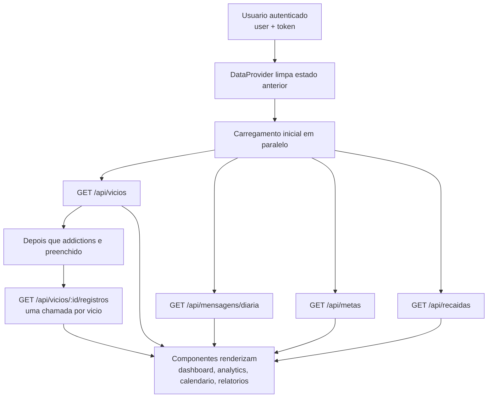
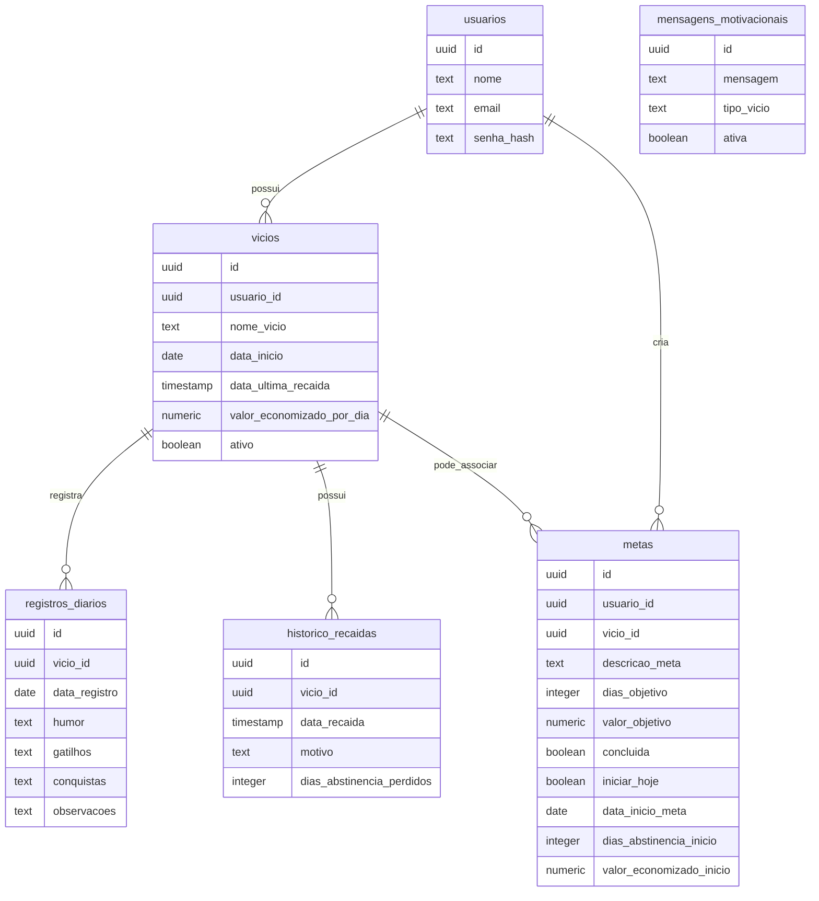
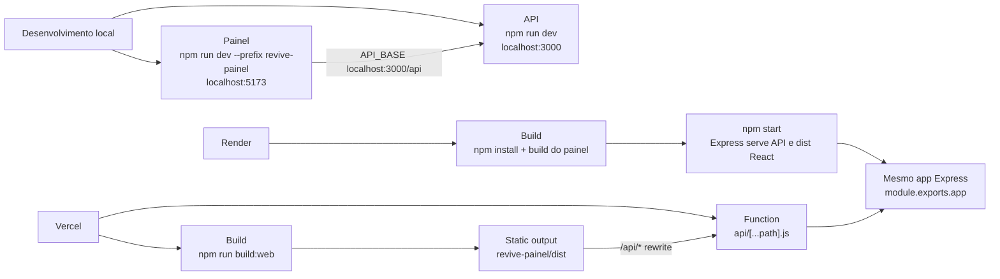

# REVIVE - Fluxograma de arquitetura

Documento gerado a partir da estrutura atual do repositorio em 2026-06-16.

## Visao geral

## Fluxo de uma requisicao autenticada

Rotas publicas de autenticacao (`/api/auth/login` e `/api/auth/cadastro`) passam por CORS, JSON, no-store, Morgan e limites especificos, mas nao passam pelo `authMiddleware`.

## Fluxo de autenticacao

Quando o app abre com um token salvo, o `AuthProvider` chama `verificarToken`, que faz `GET /api/vicios` com Bearer token. Se a API responder erro, o token e removido e o usuario volta para o fluxo publico.

## Fluxo de carregamento de dados no painel

Escritas de dados seguem o mesmo padrao: componente chama `useData`, `DataProvider` chama um service, o service chama `apiCall`, a API valida o token, confirma propriedade do recurso no Supabase e devolve JSON. Apos sucesso, o contexto recarrega ou atualiza o estado afetado.

## Banco de dados referenciado pela API

Observacao: o schema acima representa as tabelas e campos usados pelo codigo. O arquivo de migration atual adiciona campos de baseline em `metas`: `iniciar_hoje`, `data_inicio_meta`, `dias_abstinencia_inicio` e `valor_economizado_inicio`.

## Rotas, services e tabelas

| Area | Frontend service | Endpoint | Tabelas principais |
| --- | --- | --- | --- |
| Cadastro | `auth.service.js` | `POST /api/auth/cadastro` | `usuarios` |
| Login | `auth.service.js` | `POST /api/auth/login` | `usuarios` |
| Perfil | `auth.service.js` | `GET/PATCH /api/me` | `usuarios` |
| Vicios | `vicios.service.js` | `GET/POST /api/vicios` | `vicios` |
| Detalhe do vicio | `vicios.service.js` | `GET /api/vicios/:id` | `vicios` |
| Excluir vicio | `vicios.service.js` | `DELETE /api/vicios/:id` | `registros_diarios`, `historico_recaidas`, `metas`, `vicios` |
| Recaida | `vicios.service.js`, `recaidas.service.js` | `POST /api/vicios/:id/recaida`, `GET /api/recaidas` | `historico_recaidas`, `vicios` |
| Registro diario | `registros.service.js` | `POST /api/registros`, `GET /api/vicios/:id/registros` | `registros_diarios`, `vicios` |
| Mensagem diaria | `mensagens.service.js` | `GET /api/mensagens/diaria` | `mensagens_motivacionais` |
| Metas | `metas.service.js` | `GET/POST /api/metas`, `PATCH/DELETE /api/metas/:id` | `metas`, `vicios` |
| Health check | nao usado pelo painel | `GET /api/health` | nenhuma |
| Docs da API | navegador | `GET /api/docs` | nenhuma |

## Deploy e execucao

## Arquivos principais

| Arquivo | Papel |
| --- | --- |
| `index.js` | Servidor Express, conexao Supabase, middlewares, rotas REST, Swagger, health check e static hosting em producao |
| `api/[...path].js` | Adaptador serverless da Vercel que reescreve `/api/*` para o mesmo `app` Express |
| `revive-painel/src/main.jsx` | Entrada React, ordem dos providers e registro de service worker em producao |
| `revive-painel/src/App.jsx` | Arvore de rotas publicas/protegidas |
| `revive-painel/src/config/env.js` | Resolucao de `API_BASE` por ambiente |
| `revive-painel/src/services/api.js` | Adapter HTTP central com Bearer token, parse de JSON e tratamento de erro |
| `revive-painel/src/contexts/AuthContext.jsx` | Estado de autenticacao, JWT em `localStorage`, login/cadastro/logout |
| `revive-painel/src/contexts/DataContext.jsx` | Estado central de dados e orquestracao de carregamentos/escritas |
| `vercel.json` | Build do painel, output estatico e rewrites para SPA/API |
| `render.yaml` | Configuracao do web service Render e variaveis sensiveis |
| `supabase/migrations/20260616000000_add_goal_progress_baseline.sql` | Migration atual de campos de baseline de metas |

## Variaveis de ambiente usadas

| Variavel | Uso |
| --- | --- |
| `SUPABASE_URL` | URL do projeto Supabase usada pelo backend |
| `SUPABASE_SERVICE_ROLE_KEY` | Chave preferencial do backend para operar no Supabase |
| `SUPABASE_KEY` | Fallback caso a service role nao esteja definida |
| `JWT_SECRET` | Assinatura e validacao dos tokens JWT |
| `ALLOWED_ORIGINS` | Lista opcional de origens CORS permitidas |
| `PORT` | Porta local da API, padrao `3000` |
| `NODE_ENV` | Define comportamento de producao/teste/desenvolvimento |
| `VITE_API_URL` | Base da API no frontend; quando ausente usa `/api` em producao ou localhost em dev |
